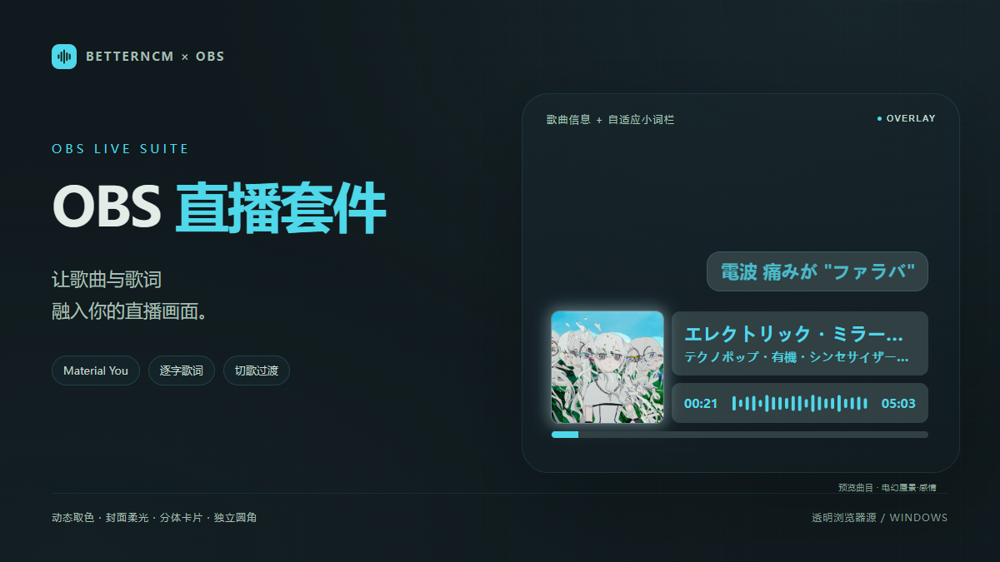
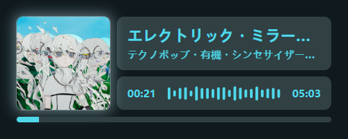
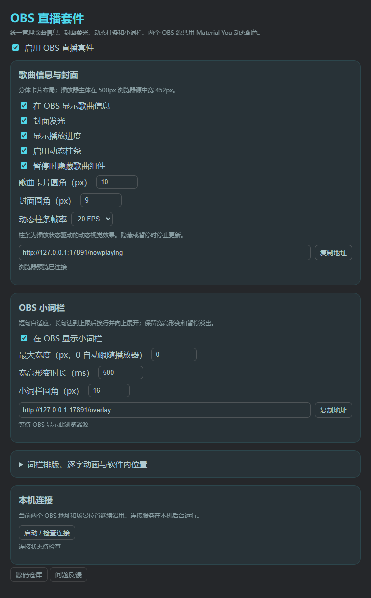

<div align="center">

# OBS 直播套件

**把网易云的歌曲信息与逐字歌词，带进你的直播画面。**

Material You 动态配色 · 发光封面 · 分体卡片 · 自适应小词栏

[](https://github.com/LilycleHeart/OBSPlaybackSuite/releases/latest)
[](https://github.com/LilycleHeart/OBSPlaybackSuite/actions/workflows/build.yml)
[](LICENSE)

[下载安装](https://github.com/LilycleHeart/OBSPlaybackSuite/releases/latest) · [快速开始](#快速开始) · [问题反馈](https://github.com/LilycleHeart/OBSPlaybackSuite/issues)



</div>

## 两个浏览器源，一套配色

| 歌曲信息 | 逐字小词栏 |
| :---: | :---: |
|  |  |
| 封面、歌名、歌手、时间与播放进度 | 中文逐字歌词、翻译、最大宽度与自动换行 |

> 预览曲目：[エレクトリック・ミラージュ・感情（电幻蜃景·感情）](https://music.163.com/song?id=2757802724)，歌手：テクノポップ・有機・シンセサイザーちゃん。封面、歌曲信息与歌词摘句来自网易云音乐，图片使用插件实际渲染的组件。网页背景透明，图片底色仅用于展示。

### 给直播画面留出空间

- **统一动态取色**：歌曲组件和小词栏共用 Material You 色板，随播放器主题变化。
- **有衔接的切歌**：旧内容淡出，新封面和歌曲信息淡入；快速切歌只显示最后一首。
- **会伸缩的小词栏**：短句收窄，长句达到最大宽度后换行，底边固定并向上展开。
- **保留歌词运动**：宿主 500ms 换句滚动、逐字高亮、宽高形变和暂停淡出。
- **少一次重复渲染**：OBS 显示词栏时，软件内词栏停止渲染；隐藏或断开后恢复。
- **独立外观设置**：歌曲卡片、封面、词栏分别调整圆角；封面柔光可开关。

动态柱条是**播放状态驱动的视觉动画，不是实时音频 FFT**。支持 10 / 15 / 20 / 30 FPS，暂停和隐藏时停止更新。

## 快速开始

### 1. 准备环境

| 项目 | 要求 |
| --- | --- |
| 系统 | Windows |
| 网易云音乐 | 2.10.x；实测 2.10.13，不支持 3.x |
| 插件框架 | BetterNCM 1.0+ |
| 前置插件 | RefinedNowPlaying、MaterialYouTheme |
| 连接服务 | [Node.js 20+](https://nodejs.org/) |
| OBS | 浏览器源；实测 OBS 29.1.3 / CEF 103 |

安装整合版前，请停用或卸载 **LyricBar、旧 OBSNowPlaying**，避免功能重复。

### 2. 安装插件

从 [Releases](https://github.com/LilycleHeart/OBSPlaybackSuite/releases/latest) 下载 `.plugin`，导入 BetterNCM 后重新打开网易云。打开 **「OBS 直播套件」** 设置并启用。

首次启动会在 BetterNCM 数据目录建立 `lyricbar-obs`，生成本机连接密钥并静默启动服务。插件启用后随网易云启动服务，无需单独设置 Windows 登录启动项。

市场收录申请正在审核；审核完成前可使用 Release 安装包。

### 3. 添加 OBS 浏览器源

| 内容 | 默认地址 | 推荐尺寸 |
| --- | --- | --- |
| 歌曲信息 | `http://127.0.0.1:17891/nowplaying` | **500 × 200** |
| 小词栏 | `http://127.0.0.1:17891/overlay` | **500 × 420** |

复制插件设置里的地址到 OBS 浏览器源，启用 **「不显示时关闭源」**。把词栏放在歌曲组件上方、右侧对齐即可。

500px 源宽度中，播放器主体占 **452px**，两侧空间留给光晕。词栏默认以此为**最大宽度**，短句仍会收窄。420px 高度是向上展开的透明预留区，实际词栏贴住底边。

## 外观与动效

<details>
<summary><strong>查看设置页预览</strong></summary>



</details>

| 设置 | 范围 / 默认值 |
| --- | --- |
| 歌曲卡片圆角 | 0–100px / 10px |
| 封面圆角 | 0–100px / 9px |
| 小词栏圆角 | 0–100px / 16px |
| 词栏最大宽度 | 0 自动跟随播放器；可自定义 |
| 宽高形变时长 | 100–2000ms / 500ms |
| 动态柱条帧率 | 10 / 15 / 20 / 30 FPS；默认 20 FPS |

圆角设为 **0** 即为直角。修改会保存并同步到 OBS。词栏排版、翻译、逐字动画帧率和软件内位置在设置页的折叠项中。

<details>
<summary><strong>连接或显示遇到问题？</strong></summary>

- **服务未连接**：确认已安装 Node.js 20+，点击「启动 / 检查连接」；安装 Node 后也可重新打开网易云。
- **OBS 没有画面**：确认浏览器源地址正确、插件已启用、网易云正在播放；两个组件默认在暂停时隐藏。可刷新浏览器源。
- **词栏被裁切**：为浏览器源保留足够高度；420px 是向上展开的预留区，不是固定词栏高度。
- **软件内词栏不显示**：OBS 正在显示时会主动停止软件内词栏渲染。隐藏 OBS 源或断开后恢复。
- **市场里还找不到**：收录需要维护者审核；请先使用 Release 安装包。

</details>

<details>
<summary><strong>本机服务与数据说明</strong></summary>

服务仅监听 `127.0.0.1`，同步当前歌曲元数据、歌词、播放时间与相关主题设置。封面由浏览器从原始图片地址加载。插件不提供音频、不采集麦克风，也不启动 OBS 直播或录制。

连接密钥在每台电脑安装时独立生成，存放在本机 `lyricbar-obs/bridge-config.json`。公开源码与安装包不含个人密钥或用户配置。不下载可执行文件，不要求管理员权限。

关闭或卸载插件后，客户端停止发布数据；已启动的 Node 服务可能继续空闲运行至进程退出。如需停止，可关闭对应 `lyricbar-obs/bridge-server.cjs` 进程。

本次仅修改显示名称，插件标识仍为 `OBSPlaybackSuite`，原有设置与浏览器源地址继续沿用。

</details>

## 开发与贡献

```sh
npm ci
npm run build
npm test
```

`src/` 是源码，`dist/` 是插件市场打包目录。GitHub Actions 会重建产物，检查认证、可见性生命周期、共享配色和凭据隔离。欢迎通过 [Issues](https://github.com/LilycleHeart/OBSPlaybackSuite/issues) 提交反馈，或发起 Pull Request。

## 致谢与许可

基于 [solstice23/lyric-bar-netease](https://github.com/solstice23/lyric-bar-netease) 的软件内词栏与设置界面，部分歌词样式和渲染逻辑来自 [RefinedNowPlaying](https://github.com/solstice23/refined-now-playing-netease)。动态主题依赖 MaterialYouTheme。

项目采用 [MIT License](LICENSE)。原始作者署名与 MIT 许可保留在 `licenses/`、`vendor/lyric-bar/LICENSE`；React、ReactDOM、ws 许可随包提供。
